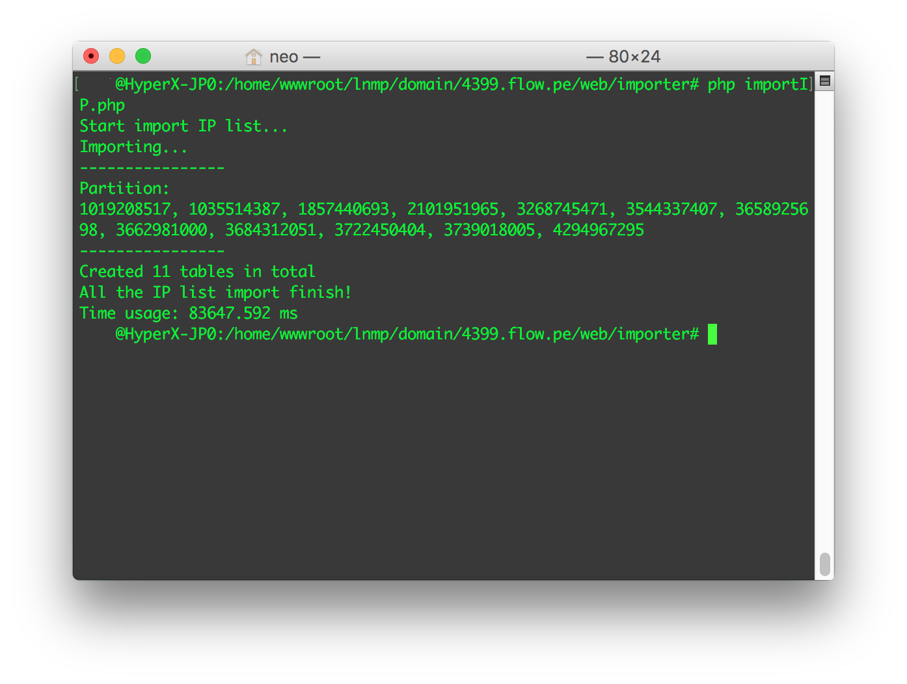

# IPFinder

IPFinder 是基于 PHP 开发的根据 IP 查询所属物理位置 API，在 Nginx 1.6.0, Mysql 5.5.40, PHP 5.6.9 下测试通过。

当前版本：Alpha [[GitHub]](https://github.com/oif/IPFinder)

相对于 Preview 版本有较大的性能提升（Preview 版本代码请见 [preview](https://github.com/oif/IPFinder/tree/preview) 分支）

***

### API 测试方式

URL结构：http://4399.oxo.cat/IP地址

例如：http://4399.oxo.cat/118.184.184.70

返回结果：

``` json
{"ip":"223.5.5.5","geo":"\u6d59\u6c5f\u7701\u676d\u5dde\u5e02\u963f\u91cc\u5df4\u5df4\u963f\u91cc\u4e91AliDNS\u670d\u52a1\u5668\n","responseTime":"0.328986ms"}
```


## 使用指北

1. 设置数据库
   - 将 <kbd>libs/SQLBase.php</kbd> 中的相关 __DB__ 参数改为你的数据库信息
2. 导入数据库
   - <kbd>php tools/importIP.php</kbd>
   - 将所获的的 partition 信息更新到 <kbd>libs/IPFinder.php</kdb> 下的 __getStorageTable()__ 函数中的 <kbd>tables</kdb> 数组

   
3. 完成！


## 版本差异

### 数据库存储

__Preview 版本__

1. 将 IP 信息存放在 varchar 中
2. 未设置约束条件
3. 手动创建数据库表

__Alpha 版本__

1. 调整 IP 字段数据库类型为 UNSIGNED INT
2. 设置适当的约束
3. 自动创建数据库表
4. 可控制表的存储数量


### 程序结构

__Preview 版本__

All in one

__Alpha 版本__

结构清晰


## 性能比较

Preview 版本（6.15）及 Alpha 版本（6.16）

### 测试环境

``` ya

- CPU: ntel(R) Xeon(R) CPU E5-2680 v2 @ 2.80GHz (1 Core)
- SSD
- 1G RAM

- Debian Wheezy
- Nginx 1.6.0
- Mysql 5.5.40
- PHP 5.6.9
```


### benchmark.php

``` php
<?php
define('TESTTIMES', 100);

function worker($ip = '119.29.9.92') {
    $curl = curl_init();
    curl_setopt($curl, CURLOPT_URL, 'http://4399.oxo.cat/'.$ip);
    curl_setopt($curl, CURLOPT_HEADER, 0);
    curl_setopt($curl, CURLOPT_RETURNTRANSFER, 1);
    $data = curl_exec($curl);
    curl_close($curl);
    preg_match("/[\d\.]*/", json_decode($data)->{'responseTime'}, $matches);
    return $matches[0];
}

function sameIPRunner($mode = 0) {
    $time = 0;
    for ($i=0; $i < TESTTIMES; $i++) {
        if ($mode) {
            $time += worker(floatIP());
        } else {
            $time += worker();
        }
        $time /= 2;
    }
    return $time;
}

function floatIP() {
    $ip = '';
    for ($i=0; $i < 4; $i++) {
        $ip .= mt_rand(0,255).'.';
    }
    return substr($ip, 0, -1);
}

echo "Start benchmark...\n\n";
echo "|----------|-------------|-----------------------|\n";
echo "|  times   |  test type  |  response time(avg)   |\n";
echo "|----------|-------------|-----------------------|\n";
echo "|  ".TESTTIMES."     |  Same IP    |  ".sameIPRunner()."ms   |\n";
echo "|  ".TESTTIMES."     |  Float IP   |  ".sameIPRunner(1)."ms   |\n";
echo "|----------|-------------|-----------------------|\n";
echo "\nDone!\n";
```


### Preview  版测试结果

``` yaml
Start benchmark...

|----------|-------------|-----------------------|
|  times   |  test type  |  response time(avg)   |
|----------|-------------|-----------------------|
|  100     |  Same IP    |  20.825212210397ms    |
|  100     |  Float IP   |  18.886438727505ms    |
|----------|-------------|-----------------------|

Done!
```


### Alpha 版测试结果

``` yaml
Start benchmark...

|----------|-------------|-----------------------|
|  times   |  test type  |  response time(avg)   |
|----------|-------------|-----------------------|
|  100     |  Same IP    |  0.34807840778584ms   |
|  100     |  Float IP   |  0.36422916678572ms   |
|----------|-------------|-----------------------|

Done!
```


## 所遇到的问题

1. 题目要求的使用 virtualbox 搭建虚拟机进行开发。
   - 遇到困难：因为以前没用过，折腾一晚上也搞不定这个玩意
   - 解决方案：从 Google 到反复折腾再到放弃治疗，用自己的服务器